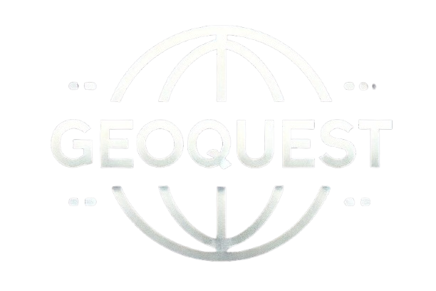

<p align="center">
  
</p>

<h1> 🌍 GeoQuest - Guess the Location (Solo Edition) </h1>
<h3 align="center">
  Test your geography skills by exploring the world through Street View.
</h3>

GeoQuest is a browser-based **single-player geolocation game** inspired by GeoGuessr.  
Players are dropped into a random real-world location via **Google Street View** and must guess the correct place on a world map. The closer your guess the higher you score
<br>

<hr/><br>

<p align="center">
  
  
  
  
</p>

<hr />

## **🔗 Live Demo**

🔗 **GeoQuest (Solo Version)**  
👉 `https://geo-quest-beta.vercel.app`

---

## **📖 Project Overview**

**GeoQuest (Solo Edition)** is a lightweight, interactive geography game built entirely with **simple web technologies language**.

The goal is simple:

1. Observe your surroundings using **Street View**
2. Analyze clues such as language, terrain, architecture, and roads
3. Place a guess on the map
4. See how close you were - distance decides your score

This project focuses on **game logic, UI design, and API integration** without relying on any backend services.

---

## **🎮 Gameplay Flow**

1️⃣ A random real-world location is selected  
2️⃣ Street View is shown to the player  
3️⃣ Player clicks on the map to guess the location  
4️⃣ The game calculates the distance between the guess and the true location  
5️⃣ Score accumulates across multiple rounds

---

## **🧱 Technical Architecture**

The project uses a **pure frontend architecture**, making it easy to deploy and run anywhere.

- **UI Layer:** HTML5 + CSS3 (custom layout & styling)
- **Game Logic:** JavaScript
- **Maps & Street View:** Google Maps JavaScript API
- **Location Data:** OpenWeatherMap API (for place name display)

No backend, database, or authentication is required.

---

## **🛠 Tech Stack**

| Component         | Technology                 |
| ----------------- | -------------------------- |
| **Frontend**      | HTML5, CSS3, JavaScript    |
| **Maps & View**   | Google Maps JavaScript API |
| **Street View**   | Google Street View         |
| **Location Info** | OpenWeatherMap API         |
| **Deployment**    | Vercel / GitHub Pages      |

---

## **✨ Key Features**

### 🌍 Immersive Exploration

- Real-world locations using **Street View**
- Smooth map interactions for guessing

### 📍 Distance-Based Scoring

- Accurate distance calculation using spherical geometry
- Score accumulates over multiple rounds

### 🧠 Skill-Based Gameplay

- No hints or assists - observation and reasoning matter
- Encourages geographic intuition and deduction

### 🎨 Clean UI

- Two-panel layout (Street View + Guess Map)
- Minimal distractions, game-focused design

---

## **📸 Screenshots**

### **1. Solo Game Interface**


### **2. Guess Placement & Result**


_(Replace screenshot paths with your actual images)_

---

## **🚀 How to Run Locally**

```bash
# Clone the repository
git clone https://github.com/Aritra7070/GeoQuest.git

# Replace with your Google maps static view API Key
google cloud--> api & services --> google maps static view--> Get api Key

# Run using Live Server or any static server
```
